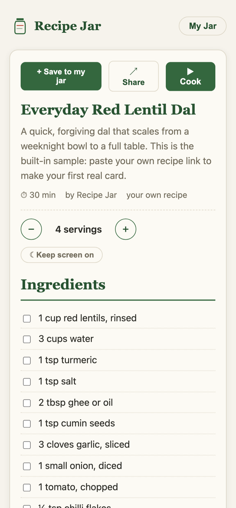
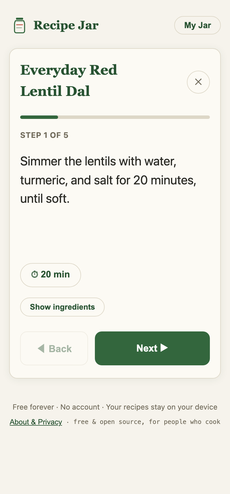
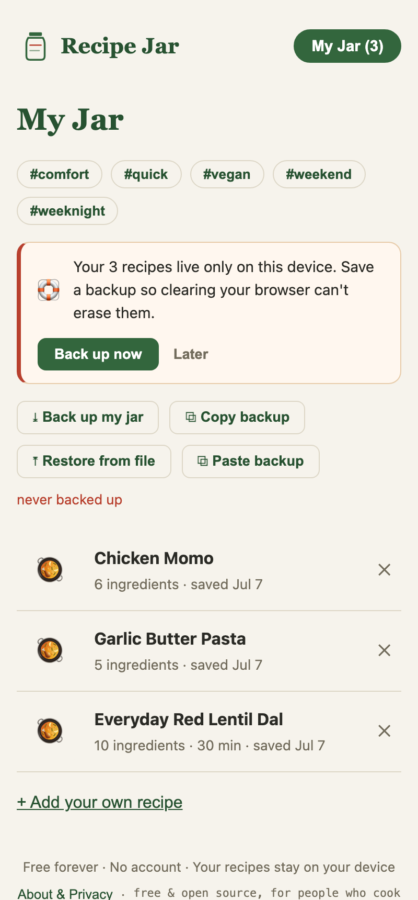

# Recipe Jar

**Just the recipe. Yours to keep.**

[](https://github.com/sbmagar13/recipe-jar/actions/workflows/ci.yml)
[](LICENSE)
[](CONTRIBUTING.md)
[](#how-its-private-and-free)

Paste a recipe link, get a clean card: ingredients and steps, nothing else. Save
as many recipes as you want. They live in your browser, on your device, not on a
server. That is why it is free forever: there is nothing for anyone to pay for.

No account. No ads. Works offline. Open source.

👉 **[recipejar.app](https://recipejar.app)**


<p align="center">
  
  &nbsp;
  
  &nbsp;
  
</p>

## Why

Recipe sites buried the food under life stories, pop-ups, and autoplaying video,
and the AI-slop wave in 2025 made it worse. The tools that clean this up then
started capping how many recipes you can save for free. So this is the boring,
honest version: paste a link, get the recipe, keep it. Forever. For nothing.

## What it does

- **Paste any recipe URL** and get a clean card. Works with most recipe sites in
  any language (it reads the structured recipe data sites already publish for Google).
- **Scale servings** with real quantity math, including fractions and metric decimals.
- **Save unlimited recipes** to your own device (IndexedDB). Search them by name
  or ingredient.
- **Type in your own** family recipes, or paste recipe text and let it auto-fill
  the fields.
- **Blocked sites** (NYT Cooking, AllRecipes, Serious Eats) that block fetching:
  use the one-click bookmarklet that runs in your own browser.
- **Back up the whole jar** to a single file, or copy it as text. Restore either way.
- **Works offline** as an installable app, and prints a clean recipe card.

## How it's private and free

There is no backend. No accounts, no database, no analytics beyond a cookieless
page count. Your recipes never leave your device, which also matters because
recipe PDFs are things people paid for. Static hosting plus on-device storage
costs nothing to run at any number of users, so "free forever" is a promise the
architecture keeps, not a pricing decision that can change.

The only server-side piece is a tiny stateless proxy (a Cloudflare Pages
Function) that fetches a page you ask for, the same way your browser's reader
mode does. It stores nothing.

## Honest comparison

| | Recipe Jar | JustTheRecipe | Copy Me That | Paprika | Recipe blogs |
|---|---|---|---|---|---|
| Free saved recipes | **Unlimited** | 20 | 40 | Paid app | n/a |
| Account required | **No** | For saving | For saving | No | No |
| Ads | **None** | Some | Some | None | Many |
| Works offline | **Yes** | Partial | Partial | Yes | No |
| Your data leaves device | **Never** | Yes | Yes | Syncs | n/a |
| Open source | **Yes** | No | No | No | n/a |
| Price | **Free** | Freemium | Freemium | ~$30 | Free + ads |

Scope, honestly: Recipe Jar keeps recipes. It does not plan meals, count
calories, or socialise. It does one daily chore well.

## Tech

Vite + Svelte + TypeScript, Dexie (IndexedDB), Workbox (offline). Static site on
Cloudflare Pages with Pages Functions for the fetch proxy and a storage-less
telemetry sink. ~60 KB gzipped. Recipes are parsed from JSON-LD
(`schema.org/Recipe`), with a microdata fallback.

## Self-host

Recipe Jar is a static site plus one tiny Cloudflare Pages Function (the fetch
proxy). You can run your own copy on Cloudflare's free tier in a couple of
minutes — there's no database to provision and no secrets required to serve it,
because every visitor's recipes live in their own browser.

[](https://deploy.workers.cloudflare.com/?url=https://github.com/sbmagar13/recipe-jar)

Or by hand:

```bash
git clone https://github.com/sbmagar13/recipe-jar
cd recipe-jar
npm install
npm run build
npx wrangler pages deploy dist   # deploys to your own <project>.pages.dev
```

The optional telemetry sink and the CI auto-deploy want the env vars documented
in [docs/CI.md](docs/CI.md) and [docs/OBSERVABILITY.md](docs/OBSERVABILITY.md),
but the app runs perfectly without either.

## Develop

```bash
npm install
npm run dev        # http://localhost:5199
npm run build      # production build to dist/
npm run check      # type check
npm run test:unit  # Vitest unit tests (parser, quantity, proxy guard)
npm run size       # gzipped bundle-size budget (run after build)
npx playwright test        # e2e across Chromium, WebKit, and mobile
```

CI (typecheck, unit, build, size budget, and a11y + app e2e) runs on every push
and PR, and auto-deploys `main` to Cloudflare Pages — see [docs/CI.md](docs/CI.md).
Privacy-respecting telemetry is documented in [docs/OBSERVABILITY.md](docs/OBSERVABILITY.md).

Handy scripts: `scripts/test-parse.ts` (parser over fixtures),
`scripts/check-offline.ts` (offline load against the built app),
`scripts/record-demo.ts` (the demo video), `scripts/make-icons.ts` /
`scripts/make-og.ts` (app icons and the social image).

## Contributing

Contributions are welcome — especially **parser fixes for sites that don't
import cleanly**, which is the single most useful thing you can do.

- **[CONTRIBUTING.md](CONTRIBUTING.md)** — dev setup, running the tests, and a
  step-by-step guide to adding support for a new recipe site.
- **[ARCHITECTURE.md](ARCHITECTURE.md)** — how the parser, the proxy, and
  on-device storage fit together, so you know where to make a change.
- **[Report a site that didn't import](https://github.com/sbmagar13/recipe-jar/issues/new?template=parser-gap.yml)** —
  the fastest way to help, even without writing code.
- Found a security issue? See **[SECURITY.md](SECURITY.md)**. Everyone taking
  part agrees to the **[Code of Conduct](CODE_OF_CONDUCT.md)**.

## License

MIT for the code. Recipe content belongs to whoever wrote it; Recipe Jar never
stores or republishes it server-side.

Free and open source, made for everyone who cooks.
